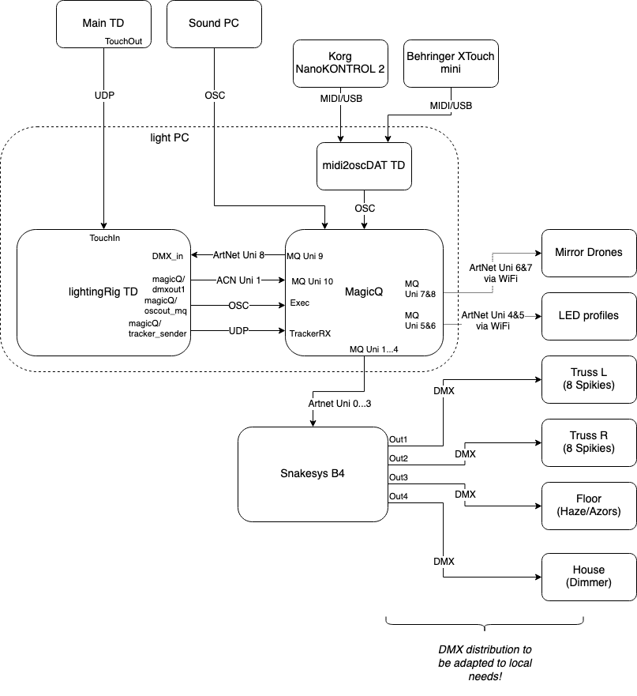
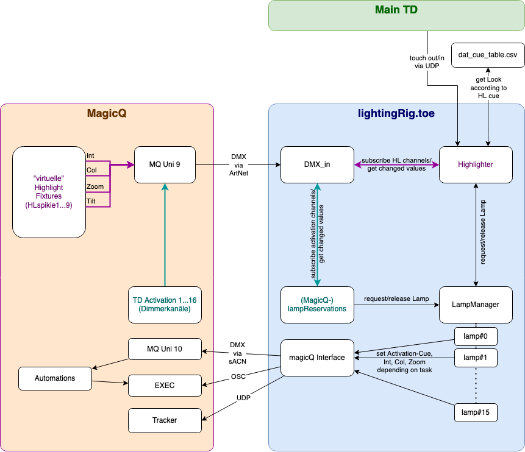

# SystemFailed Licht-Setup

## Intro

In diesem Dokument soll beschrieben werden, wie das Licht-Setup für die Performance System Failed aufgebaut ist.

Zur DMX-Erzeugung wird Chamsys MagicQ im Zusammenhang mit einem Snakesys B4 Artnet-Node verwendet.
MagicQ läuft auf dem Lichtrechner und als weitere Bedien-Interfaces werden zwei Midi-Controller verwendet.
Zur Integration der Midi-Controller gibt es ein Touchdesigner-Script ("midi2oscDAT"), das die eingehenden Midi-Werte in OSC-Messages übersetzt, die wiedrum MagicQ steuern.

Das "smarte" Element der Lichtsteuerung ist das Touchdesigner-Script lightingRig.toe.
Die relevanten Trackerpositionen, die mit Highlights beleuchtet werden sollen, werden per UDP-Stream (touchIn) vom Haupt-Touchdesigner-Patch der Show geliefert.

Im MagicQ kann mittels Aktivierungskanälen (Dimmerkanäle "TD Activation") gewählt werden, ob das lightingRig-TD oder MQ selber die Kontrolle über einzelne Spikies hat.

Die Werte der Spikies, die "TD activated" sind, können durch vom TD ausgewählte Executes überschrieben werden.

Der "Look" der Überschreibung durch TD kann im MagicQ anhand der "virtuellen" Highlight Fixtures ("HLspikie") gesetzt werden.

## MagicQ-MIDI-Interfacing

Das TD-Patch midi2oscDAT übersetzt eingehende MIDI-Messages zu osc-Messages. Im Patch gibt es eine bearbeitbare Mapping-Tabelle.

(**TODO**: Mapping-Möglichkeiten erklären, Encoderverwendung beschreiben - fine/coarse, ...)

### Troubleshooting

- Fehler: Beim Start wird der Korg nicht erkannt, TD hat ein anderes Korg device gelistet.
  
  - Lösung: Dialogs -> MIDI Device Mapper -> Device Mappings -> das richtige In Device wählen

## MagicQ und lightingRig

Im Schaubild ist der Zusammenhang der 5 Hauptkomponenten des Patches beschrieben:

- der **Highlighter** empfängt (über datexec1, script raw_highlights_exec.py) die Highlights vom Haupt TD-patch der Show. Hier werden die Spikies ausgewählt, die für jeden einzelnen Highlight verwendet werden. Neben den fortlaufend aktualisierten Positionen wird auch ein "Highlightcue" übertragen: Dieser entspricht einem bestimmten Highlight-Zweck (Performer-Highlight, Freeze-Violation, Evaluation-Highlight). Einige Grundparameter (Activation, Strobe) der Looks dieser unterschiedlichen HL und Eigenschaften wie "Anzahl der beteiligten Spikies" und "Priorität" werden aus der Tabelle dat_cue_table.csv gezogen, andere Parameter können im MagicQ per HLspikie-Fixtures gesetzt werden (Intensität, Farbe, Zoom, Höhe aka Tilt).
  (**TODO**: dat_cue_table.csv "überflüssig machen" - mindestens Shutter-Parameter auch aus MagicQ-Fixture holen, evtl. auch die anderen Parameter)

- **DMX_in** empfängt Kanäle von MagicQ und gibt sie an subscribende Komponenten weiter:
  
  - TD activation channels 1...16: Mit diesen Dimmer Channels kann gewählt werden, ob der entsprechende Spikie unter alleiniger Kontrolle von MagicQ stehen soll (= 0), oder vom lightingRig-Patch überschrieben werden kann (= 100)
  - HLspikie1...9: Mit diesen (vom Spikie kopierten) Fixtures lassen sich die grundsätzlichen Eigenschaften der generierten Highlights setzen. Die Intensität sowie die Farbe und Zoom werden auf die für den jeweiligen Highlight gewählten Spikies angewendet.

- **lampReservations** subscribed die DMX Kanäle 401...416. Für jeden Kanal mit dem Wert 0 wird die entsprechende Lampe mit maximaler Priorität vom LampManager geholt.
  (**TODO**: Lampen die in Highlights verwendet werden, werden trotz hoher Prio nicht abgezogen)

- **lampManager** verwaltet die lamp-Objekte - vergibt sie an mögliche Konsumenten (derzeit lampReservations und Highlights, geplant zB Neuronchaser oder ähnliche Engine)
  (**TODO**: Bei Request von beliebigen Lampen sollten "patterns" berücksichtigt werden - zB "möglichst gegenüberliegend" und ähnliches)

- **magicQ**-Interface sendet die nötigen Daten per OSC, sACN und UDP an MagicQ
  (**TODO**: OSC komplett durch DMX via sACN ersetzen wie schon bei Zoom und Farben implementiert)

### Troubleshooting

- Fehler: Highlights sind nicht sichtbar. 
  
  - Lösung: HighlightChannel von MagicQ kommt nicht bei TD an, weil nicht hochgezogen, oder DMX vom MQ nicht bei TD ankommt

- Fehler: DMX vom MagicQ kommt nicht bei TD an. 
  
  - Lösung: Setup DMX IO. 
  
  - Lösung: DMX-Receiver von TD funktioniert nicht richtig (im Balkendiagramm ist keine Änderung sichtbar, wenn die HLSpikie-Kanäle verändert werden) - Local Address hin und herstellen

- Fehler: TDactivation reagiert nicht, obwohl DMX ankommt. 
  
  - Lösung: Re-Init-all-Button (dann aber auch nochmal reset highlights)
